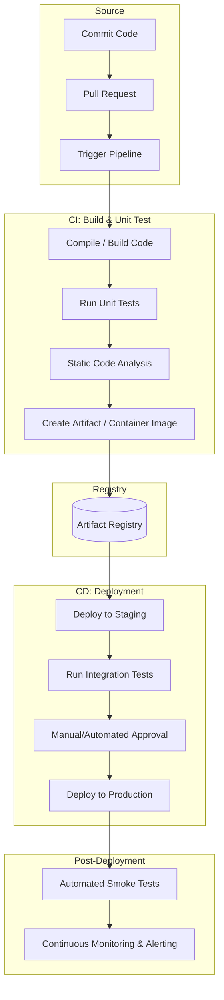

# Introduction

Let us imagine a large community center kitchen where dozens of chefs are working on a massive wedding feast. If every chef cooked their individual dishes in isolation and served them all onto the table at the last minute, the meal would be a disaster: flavors would clash, some food would be cold, and dietary restrictions would be missed. Continuous Integration and Continuous Delivery (CI/CD) is like having a head chef and an automated tasting station that constantly prepares, checks, and serves the food in small portions throughout the night. In software terms, "Continuous Integration" (CI) means that whenever a developer writes a piece of functional code, it is immediately combined with the work of all the other developers in the project and automatically evaluated for errors. "Continuous Delivery" (CD) takes that verified code and packages it so it is ready to be sent out to real users at a moment's notice. Together, they form a pipeline that moves software safely and quickly from the developer's desk to all the users.

# Problems Before CI/CD

Before CI/CD, developers worked individually in a project for weeks or months without combining their code with the code of other developers. Then, near the deadline, everyone tried to merge their changes at the same time. Merging simultaneously at the last moment caused lots of conflicts and broken code (the situation is also known as “merge hell”). Developers then had to spend days fixing code conflicts and running tests by hand just to make sure that the software still worked. Because this process was stressful and risky, releases didn’t happen very often: sometimes only once or twice a year.

# How CI/CD Solved It

CI/CD changed software delivery by turning big, scary releases into small, routine updates. Instead of working for months and merging everything at the end, developers submit small code changes throughout the day. As soon as they submit the code, a pipeline builds the software, runs tests and checks, and immediately warns the team if something is wrong. That means errors are found right away while the change is still fresh and easy to fix. Because testing and releasing are automated, teams can ship new features, security fixes, and updates smoothly and sometimes several times a day, without bothering users.

# Standard CI/CD Pipeline

CI/CD pipelines vary significantly based on organizational scale, infrastructure complexity, deployment targets, and compliance requirements. We present a industry-standard pipeline below. Note that the pipeline is not definitive.

Let us discuss the pipeline step-by-step below.

## Phase 1: Continuous Integration (CI)

### Node A: Commit Code

The entry point of the pipeline. Developers write code locally and commit their changes to a distributed version control system (VCS), such as Git. This action records a discrete delta in the repository history, tracking specific modifications to the codebase.

### Node B: Pull Request

A developer submits a pull request (PR) or merge request to propose integrating their feature branch into a shared target branch (e.g., `main`). This acts as an administrative boundary where code reviews occur and triggers automated policies before code integration.

### Node C: Trigger Pipeline

An automated event listener or webhook in the VCS detects the pull request or commit. It signals the automation server (e.g., Jenkins, GitHub Actions, GitLab CI) to provision a clean runner environment and initiate the execution of defined workflow stages.

### Node D: Compile / Build Code

The runner environment pulls the source code, resolves external software dependencies, and compiles the source code into executable binaries or bytecode. This stage verifies that the codebase is free of compilation errors and that all internal dependencies resolve successfully.

### Node E: Run Unit Tests

The pipeline executes a suite of isolated test cases designed to evaluate individual functions, classes, or methods. These tests run in a sandboxed environment without external network or database connections to verify that the fundamental logic performs to specification.

### Node F: Static Code Analysis

Automated tools (linters and Static Application Security Testing [SAST] engines) scan the uncompiled source code. This process identifies structural vulnerabilities, code smells, formatting deviations, and potential security flaws without executing the application.

### Node G: Create Artifact / Container Image

Once all preceding checks pass, the compiled binaries, assets, and runtime dependencies are packaged into an immutable, versioned deployable unit. This is typically structured as an Open Container Initiative (OCI)-compliant container image.

---

### The Bridge

#### Node H: Artifact Registry

The pipeline pushes the completed container image to a secure, centralized repository (e.g., AWS ECR, JFrog Artifactory). The registry acts as a single source of truth, storing versioned, read-only artifacts that decouple the integration phase from subsequent deployment phases.

---

### Phase 2: Continuous Delivery / Deployment (CD)

#### Node I: Deploy to Staging

The CD controller pulls the specific versioned artifact from the registry and instantiates it within a staging environment. This environment is an isolated replica configured to mirror the architecture, data volume, and network topology of the live production environment.

#### Node J: Run Integration Tests

The system executes automated end-to-end (E2E) and subsystem interoperability tests within the staging environment. This step evaluates how the newly introduced code interacts with live databases, external APIs, and peripheral network components.

#### Node K: Manual/Automated Approval

A quality gate that governs production access. Depending on organizational policy, this is either an automated check verifying 100% compliance across previous test suites, or a manual sign-off required from product or operations managers.

#### Node L: Deploy to Production

Upon approval, the pipeline initiates deployment strategies (such as rolling, blue-green, or canary updates) to push the artifact to live production servers. This minimizes user downtime while replacing older software versions with the verified artifact.

#### Node M: Automated Smoke Tests

Immediately following production deployment, a targeted suite of high-priority functional tests executes against the live environment. These tests check core paths (such as authentication and database connectivity) to ensure the deployment succeeded without critical regression.

#### Node N: Continuous Monitoring & Alerting

The final, ongoing node. Runtime observability tools continuously ingest telemetry data, application logs, and system metrics. If performance thresholds drop or error rates spike, the system triggers real-time alerts to operations teams or initiates automated rollback procedures.
