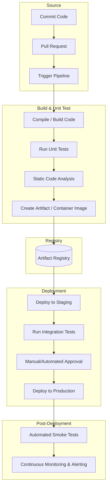

# Introduction

Let us imagine a large community center kitchen where dozens of chefs are working on a massive wedding feast. If every chef cooked their individual dishes in isolation and served them all onto the table at the last minute, the meal would be a disaster: flavors would clash, some food would be cold, and dietary restrictions would be missed. Continuous Integration and Continuous Delivery (CI/CD) is like having a head chef and an automated tasting station that constantly prepares, checks, and serves the food in small portions throughout the night. In software terms, "Continuous Integration" (CI) means that whenever a developer writes a piece of functional code, it is immediately combined with the work of all the other developers in the project and automatically evaluated for errors. "Continuous Delivery" (CD) takes that verified code and packages it so it is ready to be sent out to real users at a moment's notice. Together, they form a pipeline that moves software safely and quickly from the developer's desk to all the users.

# Problems Before CI/CD

Before CI/CD, developers worked individually in a project for weeks or months without combining their code with the code of other developers. Then, near the deadline, everyone tried to merge their changes at the same time. Merging simultaneously at the last moment caused lots of conflicts and broken code (the situation is also known as “merge hell”). Developers then had to spend days fixing code conflicts and running tests by hand just to make sure that the software still worked. Because this process was stressful and risky, releases didn’t happen very often: sometimes only once or twice a year.

# How CI/CD Solved It

CI/CD changed software delivery by turning big, scary releases into small, routine updates. Instead of working for months and merging everything at the end, developers submit small code changes throughout the day. As soon as they submit the code, a pipeline builds the software, runs tests and checks, and immediately warns the team if something is wrong. That means errors are found right away while the change is still fresh and easy to fix. Because testing and releasing are automated, teams can ship new features, security fixes, and updates smoothly and sometimes several times a day, without bothering users.

# Standard CI/CD Pipeline

CI/CD pipelines vary significantly based on organizational scale, infrastructure complexity, deployment targets, and compliance requirements. We present a industry-standard pipeline below. Note that the pipeline is not definitive.

Let us discuss the pipeline step-by-step below.

## Phase 1: Continuous Integration (CI)

### Commit Code

The pipeline begins when a developer finishes a small piece of functional code and commits it to a version control system (VCS), such as Git. The commit saves a snapshot of what changed, so the team can track exactly what was added, removed, or updated in the codebase.

### Pull Request (PR)

Usually, each developer commits code on their own feature branch. When the commits are ready, they open a pull request (PR) to merge their changes from feature branch into the shared main branch. The PR is a checkpoint where teammates review the code of the feature branch and automatic checks (like tests, rules, and policies) run before the code is merged into the shared main branch.

### Trigger Pipeline

When the developer opens (or updates) the PR, the VCS hosting platform (e.g. GitHub/GitLab/Gitea) detects that PR event and triggers (e.g. via webhooks) the automation server (such as Jenkins, GitHub Actions, or GitLab CI) to provision a temporary space (e.g. a container) and set up a clean temporary (disposable) environment.

### Compile / Build Code

After the PR triggers the pipeline and a clean temporary environment is created, the runner (a program that executes instructions in the temporary environment) downloads the PR’s code, installs the needed dependencies, and then builds/compiles the codebase into executable binaries. This step verifies that the codebase is free of compilation errors and that all internal dependencies resolve successfully.

### Run Unit Tests

Once the build is complete and the code is running as an executable, unit tests verify the internal logic. The runner executes the compiled binaries against specific, isolated inputs. Because the build step has already confirmed the code is structurally correct, unit tests focus entirely on behavior. They verify that individual pieces, such as functions or classes, produce the expected output for a given input.

### Static Code Analysis

Static code analysis involves using automated tools, such as linters and security scanners, to inspect the uncompiled source code. Unlike other testing methods, this process examines the code without executing it. The tools look for patterns that indicate potential issues, including structural weaknesses, formatting inconsistencies, security vulnerabilities, and "code smells" that suggest the code could be cleaner or more efficient.

### Create Artifact / Container Image

After the code passes the verification steps (i.e. compilation, unit testing, and static analysis) and receives approval, the feature branch merges into the main branch. This event integrates the code into the codebase. The pipeline then packages the main branch code, dependencies, libraries, and runtime files into an artifact or container image. The container ensures that the application runs consistently across deployment environments.
